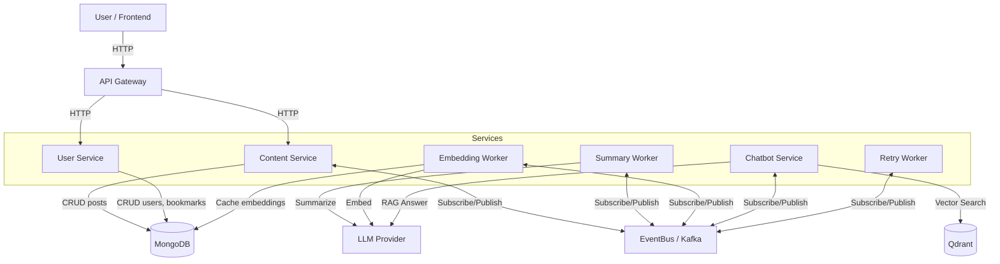
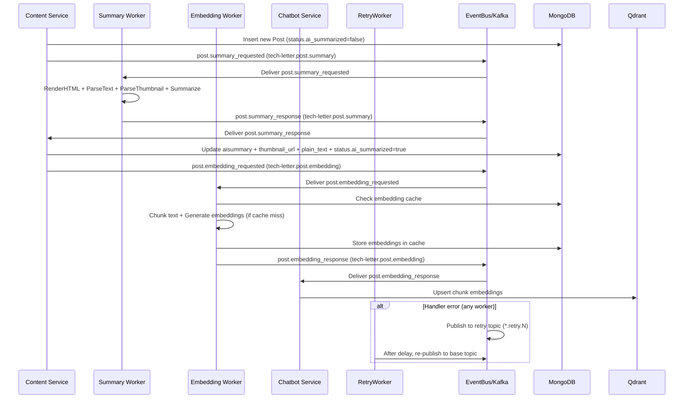
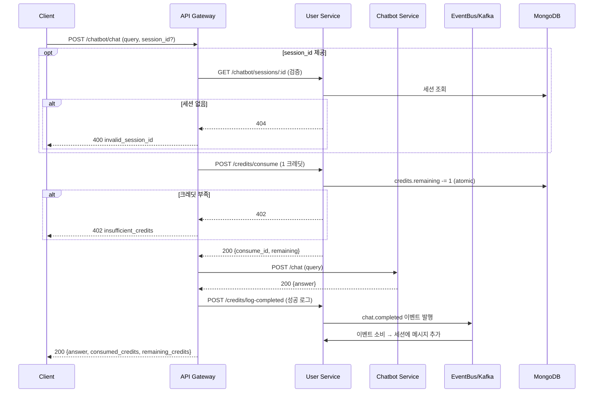

# Tech-Letter

<p align="center">
  
</p>

여러 기술 블로그의 최신 포스팅을 수집하고, AI 요약을 통해 핵심만 뽑아 읽기 좋은 뉴스레터 형식으로 전달하는 서비스입니다.
바쁜 개발자가 수십 개의 블로그를 일일이 방문하지 않아도, 관심 있는 블로그 · 카테고리 · 태그 기준으로 필터링해 한 번에 모아볼 수 있도록 돕는 것을 목표로 합니다.

### 기술 스택

- **언어**: Go 1.25.1, Python 3.11
- **웹 프레임워크**: Gin (Go), FastAPI (Python)
- **데이터베이스**: MongoDB (posts, users, bookmarks)
- **메시지 큐 / 스트리밍**: Apache Kafka
- **AI**: Google Gemini / OpenAI / Ollama / OpenRouter (LangChain 기반 LLM 팩토리)
- **패키지 관리**: Go Modules, uv (Python)
- **컨테이너**: Docker & Docker Compose

## 아키텍처

### 마이크로서비스 구조

- **API Gateway** (`cmd/api/main.go`)
  - 클라이언트 요청을 받는 단일 진입점
  - Content Service / User Service / Chatbot Service 를 호출해 응답을 조합
  - Google OAuth 기반 인증, JWT 발급/검증, 공통 에러 포맷, Swagger 문서 제공
  - **채팅 API**: 크레딧 차감, session_id 유효성 검증, 응답에 소모/잔여 크레딧 정보 포함
- **Content Service** (`content_service/app/main.py`)
  - 기술 블로그 포스트/블로그 메타데이터를 MongoDB 에 저장·조회
  - 요약 결과(요약문, 썸네일, 본문 텍스트 등)를 포스트에 반영
  - 요약 관련 이벤트(`post.summary_requested`, `post.summary_response`) 발행·구독
- **User Service** (`user_service/app/main.py`)
  - OAuth 제공자 기준 유저 식별 정보(provider, provider_sub)를 기반으로 유저를 upsert
  - 내부 표준 유저 ID(`user_code`)를 관리하고, 북마크 데이터(users/bookmarks)를 담당
  - **크레딧 시스템**: 일일 10개 자동 충전, 1채팅 = 1크레딧, 다음 날 미사용분 소멸
  - **채팅 세션**: 대화 내역 저장/조회/삭제
- **Summary Worker (Python)** (`summary_worker/app/main.py`)
  - `post.summary_requested` 이벤트를 구독해 HTML 렌더링 → 텍스트 파싱 → 썸네일 추출 → 구성된 LLM(Gemini / OpenAI / Ollama)으로 요약 수행
  - 결과를 담은 `post.summary_response` 이벤트를 발행
  - 요약 완료 후 `post.embedding_requested` 이벤트를 발행하여 임베딩 파이프라인 트리거
- **Embedding Worker (Python)** (`embedding_worker/app/main.py`)
  - `post.embedding_requested` 이벤트를 구독해 텍스트 청킹 + 임베딩 생성
  - MongoDB 기반 캐시로 중복 임베딩 비용 절감
  - 결과를 담은 `post.embedding_response` 이벤트를 발행
- **Chatbot Service (Python)** (`chatbot_service/app/main.py`)
  - `post.embedding_response` 이벤트를 구독해 Qdrant Vector DB에 임베딩 upsert
  - `/api/v1/chat` REST API를 통해 RAG 기반 질의응답 제공
  - LLM(OpenAI)을 활용한 답변 생성
- **Retry Worker** (`cmd/retryworker/main.go`)
  - eventbus 레이어가 생성한 지연/재시도 토픽을 구독
  - 지연 시간이 지난 이벤트를 다시 기본 토픽으로 재주입하여 재시도 처리
  - 최대 재시도 횟수 초과 시 DLQ 토픽으로 이동

### 어드민 API

API Gateway에서 어드민 전용 API를 제공합니다 (`/api/v1/admin/*`):

- **유저 관리**: 유저 목록 조회 (크레딧 잔액 포함)
- **크레딧 수동 지급**: 특정 유저에게 크레딧 부여
- **포스트/블로그 관리**: 목록 조회, 생성, 삭제

어드민 권한은 `user.role == "admin"` 기준으로 JWT에서 검증됩니다.

#### Architecture Diagram (Component View)



### 디렉토리 구조

```
tech-letter/
├── cmd/
│   ├── api/              # API Gateway (Go)
│   ├── retryworker/      # Retry Worker (Go)
│   └── internal/         # 내부 공통 패키지 (Go)
├── content_service/      # Content Service (Python FastAPI)
│   └── app/
│       ├── api/          # 포스트/블로그/필터 REST API 엔드포인트
│       ├── services/     # 콘텐츠 비즈니스 로직
│       └── repositories/ # MongoDB 포스트/블로그 접근 레이어
├── user_service/         # User Service (Python FastAPI)
│   └── app/
│       ├── api/          # 유저/북마크 REST API 엔드포인트
│       ├── services/     # 유저/북마크 비즈니스 로직
│       └── repositories/ # MongoDB 유저/북마크 접근 레이어
├── summary_worker/       # AI 요약 워커 (Python)
│   └── app/
│       ├── services/     # 요약 파이프라인 로직
│       └── main.py       # 이벤트 구독자
├── embedding_worker/     # 임베딩 워커 (Python)
│   └── app/
│       ├── services/     # 임베딩 파이프라인 로직
│       ├── embedder.py   # 텍스트 청킹 + 임베딩 생성
│       ├── cache.py      # MongoDB 기반 임베딩 캐시
│       └── main.py       # 이벤트 구독자
├── chatbot_service/      # RAG 챗봇 서비스 (Python FastAPI)
│   └── app/
│       ├── api/          # /chat REST API 엔드포인트
│       ├── services/     # RAG 질의응답 로직
│       ├── vector_store.py  # Qdrant Vector DB 클라이언트
│       └── main.py       # FastAPI 앱 + 이벤트 구독자
├── common/               # 공통 모델 및 유틸리티
│   └── common/
│       ├── models/       # 도메인 모델 (Post, Blog 등)
│       ├── events/       # 이벤트 정의
│       └── eventbus/     # EventBus 추상화 레이어
└── docs/                 # API 문서 및 내부 설계 문서
```

### 이벤트 플로우

1. **포스트 수집 (Content Service)**  
   RSS 피드에서 새 포스트 발견 → MongoDB에 새 포스트 저장  
   `status.ai_summarized=false` 로 초기화 후 요약 파이프라인을 트리거하기 위해 `post.summary_requested` 이벤트 발행 (`tech-letter.post.summary` 토픽)

2. **요약 + 썸네일 파이프라인 (Summary Worker)**

   - `post.summary_requested` 이벤트를 구독
   - Content Service의 요약 반영 컨슈머와는 **서로 다른 consumer group** 으로 동작해야 한다.
   - HTML 렌더링 → 텍스트 파싱 → 썸네일 추출 → Gemini 요약 수행
   - plain_text, 썸네일 URL, 요약 결과를 포함한 `post.summary_response` 이벤트 발행 (`tech-letter.post.summary`)

3. **결과 DB 반영 (Content Service)**

   - `post.summary_response` 이벤트를 구독
   - `posts.aisummary`, `posts.thumbnail_url`, `posts.plain_text` 업데이트
   - `status.ai_summarized = true` 로 상태 플래그 갱신

4. **임베딩 요청 발행 (Content Service)**

   - 요약 결과 DB 저장 성공 후 `post.embedding_requested` 이벤트 발행
   - Post 정보(title, blog_name, published_at)와 요약 결과를 포함

5. **임베딩 파이프라인 (Embedding Worker)**

   - `post.embedding_requested` 이벤트를 구독 (`tech-letter.post.embedding` 토픽)
   - 텍스트 청킹 (RecursiveCharacterTextSplitter)
   - MongoDB 캐시 확인 후 캐시 미스 시 OpenAI Embeddings API로 임베딩 생성
   - 새로 생성된 임베딩을 캐시에 저장
   - `post.embedding_response` 이벤트 발행 (`tech-letter.post.embedding` 토픽)

6. **Vector DB 업데이트 + RAG 챗봇 (Chatbot Service)**

   - `post.embedding_response` 이벤트를 구독
   - Qdrant Vector DB에 청크별 임베딩 upsert
   - `/api/v1/chat` API로 RAG 기반 질의응답 제공
   - 쿼리 임베딩 → Vector DB 검색 → LLM 답변 생성

7. **실패 시 재시도 (EventBus + Retry Worker)**

   - Summary Worker 또는 Content Service에서 이벤트 처리 실패 시, `eventbus` 레이어가 재시도 토픽(`tech-letter.post.summary.retry.N`)으로 이벤트를 이동
   - Retry Worker가 지연 시간이 지난 메시지를 다시 기본 토픽(`tech-letter.post.summary`)으로 재주입
   - 최대 재시도 횟수를 초과하면 DLQ 토픽(`tech-letter.post.summary.dlq`)으로 이동하여 후속 수동 처리

#### Event Flow Diagram



### 채팅 API 플로우 (크레딧 & 세션)

1. **세션 생성**: 클라이언트 → API Gateway → User Service → MongoDB (chat_sessions)
2. **채팅 요청**:
   - API Gateway에서 session_id 검증 (User Service 조회)
   - 크레딧 차감 (User Service)
   - RAG 질의 (Chatbot Service)
   - 성공/실패에 따라 이벤트 발행



## 인증 및 프론트엔드 연동

인증/인가 및 프론트 연동 플로우는 별도 문서에 정리되어 있다.

- 상세 스펙: [`docs/auth.md`](docs/auth.md)
  - Google OAuth 플로우
  - JWT 스펙 및 User Service 계약
  - `/api/v1/users/profile` 응답 스키마
  - CORS 및 환경 변수 설정

## 개발 가이드

### Swagger 문서 업데이트

```sh
swag init -g cmd/api/main.go -o docs
```

### Docker Compose 실행

```sh
# Kafka 및 MongoDB 실행 (별도 프로젝트)
docker network create tech-letter_default

# Tech-Letter 서비스 실행
docker-compose up -d
```

### 환경 변수 설정

`.env` 파일을 생성하고 `.env.example`을 참고하여 설정

#### Summary Worker LLM 설정

Summary Worker(Python)는 공통 LLM 팩토리(`common/common/llm/factory.py`)를 통해 여러 LLM 공급자를 지원합니다.

- `SUMMARY_WORKER_LLM_PROVIDER`
  - 사용 가능한 값: `google`, `openai`, `ollama`, `openrouter`
  - 기본값: `google`
- `SUMMARY_WORKER_LLM_MODEL_NAME`
  - 사용할 LLM 모델 이름 (예: `gemini-1.5-pro`, `gpt-4.1-mini`, `llama3.1`) **필수**
- `SUMMARY_WORKER_LLM_API_KEY`
  - `google` / `openai` / `openrouter` 사용 시 필수
  - `ollama` 사용 시 로컬 Ollama 서버를 호출하므로 이 값은 설정하지 않아도 되고, 설정해도 무시됩니다.
- `SUMMARY_WORKER_LLM_TEMPERATURE`
  - 선택값, 기본값 `0.3`
- `SUMMARY_WORKER_LLM_MAX_RETRIES`
  - 선택값, 기본값 `0` (LangChain LLM 레벨 재시도 횟수)
  - `0`이면 LangChain이 동일 요청을 재시도하지 않고 즉시 예외를 반환
- `SUMMARY_WORKER_LLM_BASE_URL`
  - 선택값, 주로 `ollama` 또는 `openrouter` 사용 시 의미 있음
  - `ollama` 사용 시 설정하지 않으면 Ollama 기본 base URL(일반적으로 `http://localhost:11434`)을 사용
  - `openrouter` 사용 시 값을 비우면 기본값 `https://openrouter.ai/api/v1` 를 사용

예시:

```env
# 공통 재시도 설정 (옵션, 기본 0)
# SUMMARY_WORKER_LLM_MAX_RETRIES=0

# Google Gemini 사용
SUMMARY_WORKER_LLM_PROVIDER=google
SUMMARY_WORKER_LLM_MODEL_NAME=gemini-1.5-pro
SUMMARY_WORKER_LLM_API_KEY=your-gemini-api-key

# OpenAI 사용
# SUMMARY_WORKER_LLM_PROVIDER=openai
# SUMMARY_WORKER_LLM_MODEL_NAME=gpt-4.1-mini
# SUMMARY_WORKER_LLM_API_KEY=your-openai-api-key

# OpenRouter 사용 (OpenAI 호환 API)
# SUMMARY_WORKER_LLM_PROVIDER=openrouter
# SUMMARY_WORKER_LLM_MODEL_NAME=google/gemini-2.0-flash-001  # 예시, OpenRouter에서 제공하는 모델 이름
# SUMMARY_WORKER_LLM_API_KEY=your-openrouter-api-key
# SUMMARY_WORKER_LLM_BASE_URL=https://openrouter.ai/api/v1

# Ollama 사용 (로컬 ollama 서버 필요)
# SUMMARY_WORKER_LLM_PROVIDER=ollama
# SUMMARY_WORKER_LLM_MODEL_NAME=llama3.1
# SUMMARY_WORKER_LLM_API_KEY=  # 비워 두거나 설정하지 않아도 됨
# SUMMARY_WORKER_LLM_BASE_URL=http://localhost:11434  # 또는 원격 Ollama 서버 URL
```

#### Embedding Worker LLM 설정

Embedding Worker도 공통 LLM 팩토리(`common/common/llm/factory.py`)를 통해 여러 LLM 공급자를 지원합니다.

- `EMBEDDING_WORKER_LLM_PROVIDER`
  - 사용 가능한 값: `google`, `openai`, `ollama`, `openrouter`
  - 기본값: `openai`
- `EMBEDDING_WORKER_LLM_MODEL_NAME`
  - 사용할 임베딩 모델 이름 (예: `text-embedding-3-small`, `text-embedding-ada-002`)
  - 기본값: `text-embedding-3-small`
- `EMBEDDING_WORKER_LLM_API_KEY`
  - `google` / `openai` / `openrouter` 사용 시 필수
- `EMBEDDING_WORKER_LLM_BASE_URL`
  - 선택값, 주로 `ollama` 또는 커스텀 엔드포인트 사용 시 설정
- `EMBEDDING_WORKER_CHUNK_SIZE`
  - 텍스트 청킹 크기 (기본값: `1000`)
- `EMBEDDING_WORKER_CHUNK_OVERLAP`
  - 청크 간 오버랩 크기 (기본값: `200`)

예시:

```env
# OpenAI 사용 (기본)
EMBEDDING_WORKER_LLM_PROVIDER=openai
EMBEDDING_WORKER_LLM_MODEL_NAME=text-embedding-3-small
EMBEDDING_WORKER_LLM_API_KEY=your-openai-api-key

# Google 사용
# EMBEDDING_WORKER_LLM_PROVIDER=google
# EMBEDDING_WORKER_LLM_MODEL_NAME=models/embedding-001
# EMBEDDING_WORKER_LLM_API_KEY=your-google-api-key

# Ollama 사용 (로컬)
# EMBEDDING_WORKER_LLM_PROVIDER=ollama
# EMBEDDING_WORKER_LLM_MODEL_NAME=nomic-embed-text
# EMBEDDING_WORKER_LLM_BASE_URL=http://localhost:11434
```

### Kafka 토픽

- `tech-letter.post.summary`: 요약 파이프라인 이벤트 (`post.summary_requested`, `post.summary_response`)
- `tech-letter.post.embedding`: 임베딩 파이프라인 이벤트 (`post.embedding_requested`, `post.embedding_response`)
- `tech-letter.credit`: 크레딧 관련 이벤트 (`credit.consumed`, `credit.granted`)
- `tech-letter.chat`: 채팅 관련 이벤트 (`chat.completed`, `chat.failed`)
- `tech-letter.newsletter.events`: 뉴스레터 관련 이벤트 (Phase 3)

## 서비스 포트

- **API Gateway**: 8080 (클라이언트용 REST API)
- **Content Service**: 8001 (내부 서비스 API)
- **User Service**: 8002 (내부 서비스 API - 유저/북마크)
- **Chatbot Service**: 8003 (RAG 챗봇 API)
- **Qdrant**: 6333 (Vector DB HTTP), 6334 (gRPC)
- Kafka: 9092
- Kafka UI: 8081
