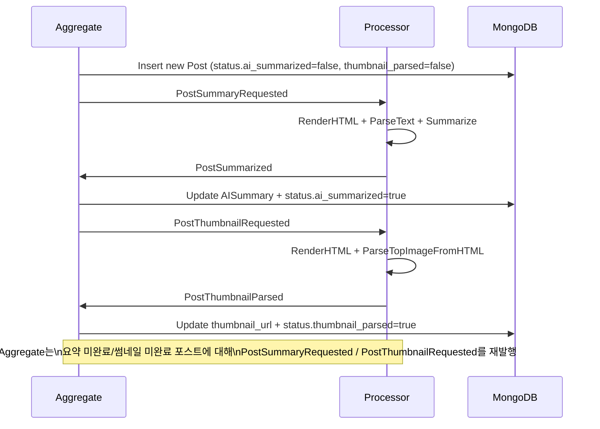

# Tech-Letter

여러 기술 블로그의 최신 포스팅을 요약하여 뉴스레터 형식으로 제공하는 서비스

## 아키텍처

### 이벤트 기반 마이크로서비스 구조

- **API 서버** (`cmd/api/main.go`): REST API 제공 (포트 8080)
- **Aggregate 서버** (`cmd/aggregate/main.go`):
  - RSS 수집 및 신규 포스트 MongoDB 저장
  - `PostSummaryRequested`, `PostThumbnailRequested` 이벤트 발행
  - `PostSummarized`, `PostThumbnailParsed` 이벤트를 구독해 DB 업데이트
- **Processor 서버** (`cmd/processor/main.go`):
  - `PostSummaryRequested` 이벤트를 구독해 HTML 렌더링 → 텍스트 파싱 → AI 요약 → `PostSummarized` 발행
  - `PostThumbnailRequested` 이벤트를 구독해 썸네일 파싱 → `PostThumbnailParsed` 발행

### 기술 스택

- **언어**: Go 1.25.1
- **웹 프레임워크**: Gin
- **데이터베이스**: MongoDB
- **메시지 큐**: Apache Kafka
- **AI**: Google Gemini API
- **컨테이너**: Docker & Docker Compose

### 이벤트 플로우

1. **포스트 수집 (Aggregate)**  
   RSS 피드에서 새 포스트 발견 → MongoDB에 새 포스트 저장
   (`status.ai_summarized=false`, `status.thumbnail_parsed=false`) →
   요약 요청 이벤트 `PostSummaryRequested` 와 썸네일 요청 이벤트 `PostThumbnailRequested` 를 **동시에 발행**

2. **요약 파이프라인 (Processor)**

   - `PostSummaryRequested` 이벤트를 구독
   - HTML 렌더링 → 텍스트 파싱 → Gemini 요약 수행
   - 요약 결과를 포함한 `PostSummarized` 이벤트 발행 (DB에는 직접 쓰지 않음)

3. **요약 DB 반영 (Aggregate)**

   - `PostSummarized` 이벤트를 구독
   - `posts.aisummary` 업데이트
   - `status.ai_summarized = true` 로 상태 플래그 갱신

4. **썸네일 파이프라인 (Processor)**

   - `PostThumbnailRequested` 이벤트를 구독
   - HTML 렌더링 → 썸네일 파싱(메타 태그, `<link>`, `` + 실제 이미지 사이즈 검사)
   - 파싱 결과를 담은 `PostThumbnailParsed` 이벤트 발행

5. **썸네일 DB 반영 (Aggregate)**

   - `PostThumbnailParsed` 이벤트를 구독
   - `posts.thumbnail_url` 업데이트
   - `status.thumbnail_parsed = true` 로 상태 플래그 갱신

6. **자동 복구 파이프라인 (Aggregate)**

   - 6시간마다 `status.ai_summarized=false` 인 포스트 일부를 조회 →
     각 포스트에 대해 `PostSummaryRequested` 재발행 (요약 재시도)
   - 6시간마다 `status.thumbnail_parsed=false` 인 포스트 일부를 조회 →
     각 포스트에 대해 `PostThumbnailRequested` 재발행 (썸네일 파싱 재시도)

#### Event Flow Diagram



## 개발 가이드

### Swagger 문서 업데이트

```sh
swag init -g cmd/api/main.go -o docs
```

### Docker Compose 실행

```sh
# Kafka 및 MongoDB 실행 (별도 프로젝트)
docker network create tech-letter_default

# Tech-Letter 서비스 실행
docker-compose up -d
```

### 환경 변수 설정

`.env` 파일을 생성하고 `.env.example`을 참고하여 설정

### Kafka 토픽

- `tech-letter.post.events`: 포스트 관련 이벤트
- `tech-letter.newsletter.events`: 뉴스레터 관련 이벤트 (Phase 2)

## 서비스 포트

- API 서버: 8080
- Kafka UI: 8081
- Kafka: 9092
