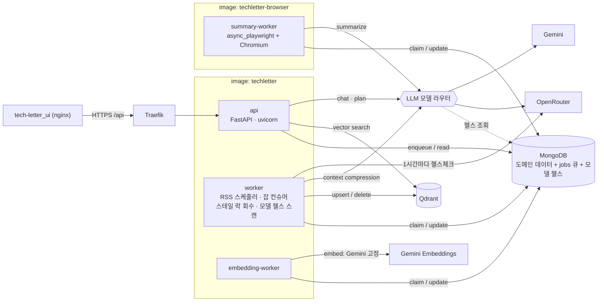

# Tech-Letter

<p align="center">
  
</p>

여러 기술 블로그의 최신 포스팅을 수집하고, AI 요약을 통해 핵심만 뽑아 읽기 좋은 뉴스레터 형식으로 전달하는 서비스입니다.
바쁜 개발자가 수십 개의 블로그를 일일이 방문하지 않아도, 관심 있는 블로그 · 카테고리 · 태그 기준으로 필터링해 한 번에 모아볼 수 있도록 돕는 것을 목표로 합니다.

### 기술 스택

- **언어**: Python 3.12
- **웹 프레임워크**: FastAPI + uvicorn (async 전용)
- **데이터베이스**: MongoDB (도메인 데이터 + 잡 큐), Qdrant (벡터 검색)
- **AI**: Google Gemini(요약·임베딩 1순위) / OpenRouter(챗봇·요약 폴백) — 큐레이션과 실시간 헬스체크를 교차한 LLM 모델 라우터, LangChain/LangGraph 기반
- **패키지 관리**: uv
- **컨테이너**: Docker & Docker Compose (이미지 2개, 프로세스 4개 — 아래 참고)

## 아키텍처

### 프로세스 뷰

하나의 Python 패키지 `techletter`, 진입점 `techletter <command>` 하나에서 프로세스 4종이 나온다.


```mermaid
flowchart LR
    FE["tech-letter_ui (nginx)"] -->|HTTPS /api| T[Traefik]
    T --> API

    subgraph img1["image: techletter"]
        API["api<br/>FastAPI · uvicorn"]
        W["worker<br/>RSS 스케줄러 · 잡 컨슈머<br/>스테일 락 회수 · 모델 헬스 스캔"]
        EW["embedding-worker"]
    end
    subgraph img2["image: techletter-browser"]
        SW["summary-worker<br/>async_playwright + Chromium"]
    end

    API -->|enqueue / read| M[("MongoDB<br/>도메인 데이터 + jobs 큐 + 모델 헬스")]
    W -->|claim / update| M
    SW -->|claim / update| M
    EW -->|claim / update| M

    API -->|vector search| Q[(Qdrant)]
    W -->|upsert / delete| Q

    API -->|chat · plan| R{{"LLM 모델 라우터"}}
    W -->|context compression| R
    W -->|1시간마다 헬스체크| OR
    SW -->|summarize| R
    EW -->|embed: Gemini 고정| G[Gemini Embeddings]
    R -.->|헬스 조회| M
    R --> OR[OpenRouter]
    R --> GG[Gemini]
```

| 프로세스 | 명령 | 책임 |
|---|---|---|
| **api** | `techletter api` | HTTP 전부(공개·어드민), 인증/인가, 채팅 오케스트레이션(가드→세션→크레딧→에이전트→기록), SSE, OpenAPI. 잡은 **enqueue만** 한다 |
| **worker** | `techletter worker` | RSS 수집(30분 주기), 잡 소비 — 요약 완료 반영 및 임베딩 enqueue, 임베딩 완료 → Qdrant upsert, 삭제 요청, 채팅 컨텍스트 압축. 스테일 락 회수 · done 잡 TTL 관리도 겸한다 |
| **summary-worker** | `techletter summary-worker` | 요약 잡 처리: 렌더링(Playwright) → 파싱 → 검증 → 썸네일 → LLM 요약. 별도 이미지(`techletter-browser`, Chromium 포함) |
| **embedding-worker** | `techletter embedding-worker` | 임베딩 잡 처리: 청킹 + 임베딩 생성(Gemini 고정) |

로컬 개발용 `techletter all`(api + worker 단일 프로세스)도 있다. 컨슈머 그룹·오프셋 개념이 없다 — 워커를 늘리면 같은 `jobs` 컬렉션을 원자적 클레임으로 나눠 가진다.

### 논리 뷰 — 모듈러 모놀리스

```
src/techletter/
├── api/           HTTP 경계. 라우터(v1/*)·DTO(schemas/)·의존성(deps.py)·에러 변환. 비즈니스 로직 없음
├── content/       posts·blogs, RSS 수집(rss/), 필터·트렌드 집계, 잡 enqueue
├── users/         users·credits(원자적 차감)·bookmarks·login_sessions, Google OAuth
├── chat/          세션·추천질문, LangGraph 에이전트(agent/), 가드(guards/), 대화 메모리, 유스케이스
├── summary/       요약 파이프라인 — renderer·parser·validator·summarizer
├── embedding/     청킹(chunker.py)·임베딩 파이프라인(pipeline.py)
├── core/          settings, logging, errors, time, db(mongo/qdrant), jobs(★큐), llm(라우터·예산), security, http
└── workers/       프로세스 진입점 — runtime(잡 러너·graceful shutdown), scheduler, core/summary/embedding worker
```

의존 방향(모듈 경계): `api → {content, users, chat, embedding} → core`. 도메인 간은 `chat → content, users, embedding`만 허용, `content ↔ users`는 금지. 도메인 패키지는 FastAPI를 import하지 않는다. 상세는 [directory-structure](docs/architecture/directory-structure.md).

### 잡 큐

비동기 작업(요약·임베딩·채팅 컨텍스트 압축)은 별도 메시지 브로커 없이 Mongo `jobs` 컬렉션 하나로 처리한다.

```
enqueue ──▶ pending ──claim──▶ running ──성공──▶ done ──(TTL 14일)──▶ 삭제
                ▲                   │
                │   RetryableError  │  run_at = now + backoff[attempt]
                └───────────────────┘
                                    │  QuotaExceeded → run_at = 쿼터 리셋, attempt 롤백
                                    │
                                    └── PermanentError | attempt>max ──▶ dead(사유 기록, 어드민 조회)
스테일 락(running & locked_at < now-timeout) ──▶ pending
```

- 잡 타입: `summary.requested/completed`, `embedding.requested/completed/delete_requested`, `chat.compression_requested`.
- 우선순위: 신규 포스트 `priority=0`, 백필 `priority=10` — 백필이 신규 처리를 밀어내지 않는다.
- 중복 억제: 같은 `(key, type)`가 pending/running이면 enqueue 생략.
- 조회: `GET /api/v1/admin/jobs`, `/admin/jobs/stats`, CLI `techletter jobs list|stats|retry|purge`.

### LLM 모델 라우터

```
요약   : Gemini(일일 예산) → 소진 시 OpenRouter[큐레이션 ∩ scouter 헬스]로 순차 폴백
챗봇   : OpenRouter[큐레이션 ∩ scouter 헬스]
임베딩 : Gemini gemini-embedding-001 고정
```

같은 프로세스가 provider가 다른 후보들 사이를 오갈 수 있어야 하므로, `RoutingChatClient`가 요청된 `model_id`를 보고 Gemini 클라이언트와 OpenRouter 클라이언트 중 하나로 정확히 라우팅한다. `worker`가 1시간마다 OpenRouter의 `:free` 모델 전체를 자체적으로 헬스체크해 후보를 좁히고, 기록이 없으면 정적 폴백 목록으로 계속 동작한다. 모델별 성적은 `llm_model_stats`에 기록되어 자동 강등되고 어드민 화면(`/admin/llm-models`)에 노출된다.

## API

경로·스키마·에러 코드 체계는 [api-contract](docs/architecture/api-contract.md)에 정리돼 있다. 라우터는 `src/techletter/api/v1/`:

- `posts`, `blogs`, `filters`, `trends` — 공개 콘텐츠 조회
- `me`, `bookmarks`, `auth` — 사용자 프로필, 북마크, Google OAuth 로그인
- `chat` — 세션·크레딧·LangGraph 에이전트 질의응답(SSE 스트리밍 포함)
- `admin/*` — 잡 큐 조회·재시도, 백필 트리거, 블로그/포스트/유저/추천질문 관리, 모델 성적 대시보드

에러 응답은 `{"error": {"code": "...", "message": "..."}}` 단일 봉투로 통일돼 있다.

## 로컬 개발

```bash
uv sync
uv run playwright install --only-shell chromium   # summary-worker(렌더링)에 필요

docker compose -f docker/compose.dev.yml up -d mongo qdrant

cp .env.example .env && $EDITOR .env        # 로컬 기본값 포함 템플릿. 시크릿만 채우면 된다
# 전체 env var 목록이 코드와 어긋났는지 의심되면 재생성해 비교한다:
#   uv run techletter settings example

uv run techletter ensure-indexes
uv run techletter all --reload              # api + worker
uv run techletter summary-worker            # 별도 터미널
uv run techletter embedding-worker           # 별도 터미널

uv run pytest -q                                                    # 단위
TEST_MONGO_URI=mongodb://localhost:27018 uv run pytest -q -m integration  # 통합(컨테이너 필요)
uv run ruff check src tests scripts && uv run ruff format --check src tests scripts
uv run pyright
```

프론트: `tech-letter_ui/`에서 `VITE_API_BASE_URL=http://localhost:8080 npm run dev`.

`techletter settings check`로 필수 환경변수가 다 채워졌는지 값 노출 없이 검증할 수 있다.

## 배포 · 운영

운영 서버 구성, 컨테이너 4개(api/worker/summary-worker/embedding-worker) + nginx, GitHub Actions 무중단 배포(이미지 빌드 → `up -d --wait` → 스모크 → 실패 시 자동 롤백), 관측 기준선, 런북은 [deployment-and-ops](docs/architecture/deployment-and-ops.md)에 정리돼 있다. 실제 배포 절차(커밋부터 검증까지)는 워크스페이스 루트 `AGENTS.md`("변경사항 배포").

## 더 읽기

[`docs/README.md`](docs/README.md) — 아키텍처·API·데이터 모델·테스트·운영 문서 전체 목차.
