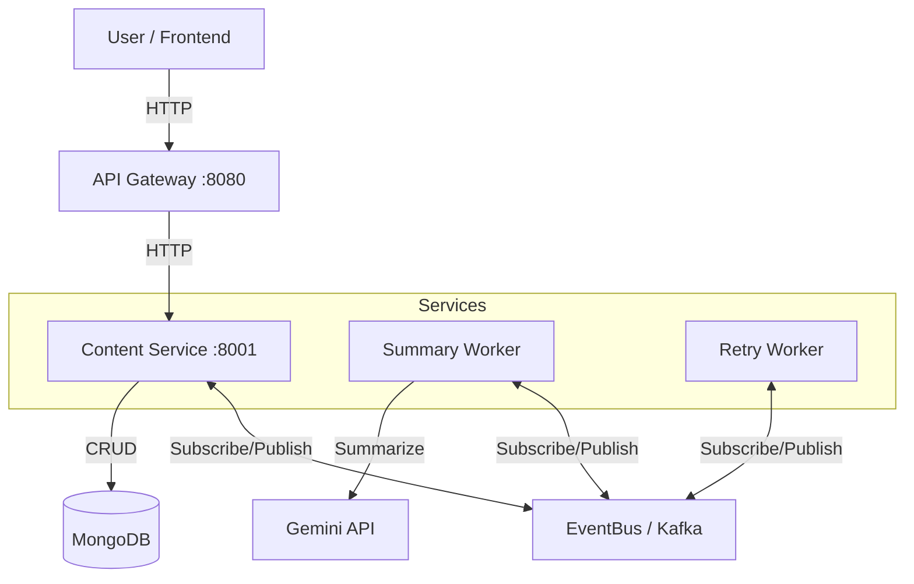

# Tech-Letter

여러 기술 블로그의 최신 포스팅을 요약하여 뉴스레터 형식으로 제공하는 서비스

### 기술 스택

- **언어**: Go 1.25.1
- **웹 프레임워크**: Gin
- **데이터베이스**: MongoDB
- **메시지 큐**: Apache Kafka
- **AI**: Google Gemini API
- **컨테이너**: Docker & Docker Compose

## 아키텍처

### 마이크로서비스 구조

- **API Gateway** (`cmd/api/main.go`): REST API 제공 (포트 8080)
  - 클라이언트 요청을 받아 Content Service의 REST API로 프록시
  - 사용자 인증/인가 처리 (향후 구현 예정)
  - Swagger 문서 제공
- **Content Service** (`content_service/app/main.py`): 콘텐츠 관리 서비스 (포트 8001)
  - MongoDB 직접 접근 및 CRUD 작업 수행
  - 포스트/블로그 데이터 조회 API 제공
  - 이벤트 구독 및 발행 (PostCreated, PostSummarized)
- **Summary Worker (Python)** (`summary_worker/app/main.py`):
  - `PostCreated` 이벤트를 구독해 HTML 렌더링 → 텍스트 파싱 → 썸네일 추출 → AI 요약 수행
  - 결과를 담은 `PostSummarized` 이벤트 발행 (DB에는 직접 쓰지 않음)
- **Retry Worker** (`cmd/retryworker/main.go`):
  - `eventbus` 레이어가 생성한 지연/재시도 토픽(`*.retry.N`)을 구독
  - 지연 시간이 지난 이벤트를 다시 기본 토픽으로 재주입하여 재시도 처리
  - 최대 재시도 횟수 초과 시 DLQ 토픽으로 이동

#### Architecture Diagram (Component View)



### 디렉토리 구조

```
tech-letter/
├── cmd/
│   ├── api/              # API Gateway (Go)
│   ├── retryworker/      # Retry Worker (Go)
│   └── internal/         # 내부 공통 패키지 (Go)
├── content_service/      # Content Service (Python FastAPI)
│   └── app/
│       ├── api/          # REST API 엔드포인트
│       ├── services/     # 비즈니스 로직
│       └── repositories/ # MongoDB 접근 레이어
├── summary_worker/       # AI 요약 워커 (Python)
│   └── app/
│       ├── services/     # 요약 파이프라인 로직
│       └── main.py       # 이벤트 구독자
├── common/               # 공통 모델 및 유틸리티
│   └── common/
│       ├── models/       # 도메인 모델 (Post, Blog 등)
│       ├── events/       # 이벤트 정의
│       └── eventbus/     # EventBus 추상화 레이어
└── docs/                 # Swagger 문서
```

### 이벤트 플로우

1. **포스트 수집 (Content Service)**  
   RSS 피드에서 새 포스트 발견 → MongoDB에 새 포스트 저장  
   `status.ai_summarized=false` 로 초기화 후 `PostCreated` 이벤트 발행 (`tech-letter.post.events` 토픽)

2. **요약 + 썸네일 파이프라인 (Summary Worker)**

   - `PostCreated` 이벤트를 구독
   - HTML 렌더링 → 텍스트 파싱 → 썸네일 추출 → Gemini 요약 수행
   - 렌더링된 HTML, 썸네일 URL, 요약 결과를 포함한 `PostSummarized` 이벤트 발행 (`tech-letter.post.events`)

3. **결과 DB 반영 (Content Service)**

   - `PostSummarized` 이벤트를 구독
   - `posts.aisummary`, `posts.thumbnail_url`, `posts.rendered_html`, `posts.plain_text` 업데이트
   - `status.ai_summarized = true` 로 상태 플래그 갱신

4. **실패 시 재시도 (EventBus + Retry Worker)**

   - Summary Worker 또는 Content Service에서 이벤트 처리 실패 시, `eventbus` 레이어가 재시도 토픽(`tech-letter.post.events.retry.N`)으로 이벤트를 이동
   - Retry Worker가 지연 시간이 지난 메시지를 다시 기본 토픽(`tech-letter.post.events`)으로 재주입
   - 최대 재시도 횟수를 초과하면 DLQ 토픽(`tech-letter.post.events.dlq`)으로 이동하여 후속 수동 처리

#### Event Flow Diagram


## 인증 및 프론트엔드 연동

인증/인가 및 프론트 연동 플로우는 별도 문서에 정리되어 있다.

- 상세 스펙: [`docs/auth.md`](docs/auth.md)
  - Google OAuth 플로우
  - JWT 스펙 및 User Service 계약
  - `/api/v1/users/profile` 응답 스키마
  - CORS 및 환경 변수 설정

## 개발 가이드

### Swagger 문서 업데이트

```sh
swag init -g cmd/api/main.go -o docs
```

### Docker Compose 실행

```sh
# Kafka 및 MongoDB 실행 (별도 프로젝트)
docker network create tech-letter_default

# Tech-Letter 서비스 실행
docker-compose up -d
```

### 환경 변수 설정

`.env` 파일을 생성하고 `.env.example`을 참고하여 설정

### Kafka 토픽

- `tech-letter.post.events`: 포스트 관련 이벤트
- `tech-letter.newsletter.events`: 뉴스레터 관련 이벤트 (Phase 2)

## 서비스 포트

- **API Gateway**: 8080 (클라이언트용 REST API)
- **Content Service**: 8001 (내부 서비스 API)
- Kafka: 9092
- Kafka UI: 8081
