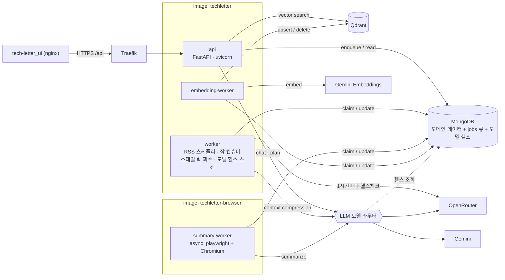

# 아키텍처

## 1. 프로세스 뷰

하나의 Python 패키지 `techletter`에서 프로세스 4종이 나온다. 진입점은 `techletter <cmd>` CLI 하나다.



| 프로세스 | 명령 | 책임 | 하지 않는 것 |
|---|---|---|---|
| **api** | `techletter api` | HTTP 전부(공개·어드민), 인증/인가, 채팅 오케스트레이션(가드→세션→크레딧→에이전트→기록/환불), SSE, OpenAPI. 잡은 **enqueue만** | 잡 소비, 스케줄러, Playwright |
| **worker** | `techletter worker` | RSS 수집(30분 주기), 잡 소비: `summary.completed` 반영·`embedding.requested` enqueue / `embedding.completed` → posts 임베딩 메타 반영 / `chat.compression_requested`. `model_scan`·`model_history_rollup`(각 1시간, 시작 시 실행)도 담당한다. run_at 도래분은 클레임 쿼리가 자동 pending 복귀시킨다 + **스테일 락 회수** + done 잡 TTL 관리 | Qdrant upsert/delete, HTTP 서빙 |
| **summary-worker** | `techletter summary-worker` | 두 단계를 맡는다. `content.fetch_requested` → 렌더링(HTTP 상태·늦은 렌더 대기·HTTP/피드 본문 폴백)·추출·검증·썸네일 → 본문을 posts에 저장 → `summary.requested`. `summary.requested` → 저장된 본문으로 LLM 요약 → `summary.completed`. 막힌 원문은 LLM을 부르지 않고, 재요약은 원문을 다시 받지 않는다. 영구 실패 사유는 posts에 기록한다. LLM 예산·모델 라우팅 적용 | Qdrant, 영구 실패 사유 외의 도메인 쓰기 |
| **embedding-worker** | `techletter embedding-worker` | `embedding.requested` 잡 → 청킹·임베딩 → Qdrant upsert → `embedding.completed` enqueue. `embedding.delete_requested` 잡은 Qdrant delete로 처리한다 | HTTP 서빙 |

- 로컬 개발용 `techletter all`(api + worker 단일 프로세스)을 제공한다.
- 컨슈머 그룹·오프셋·리밸런스 개념이 없다. 워커를 늘리면 같은 `jobs` 컬렉션에서 원자적으로 나눠 가진다.

## 2. 논리 뷰 — 모듈러 모놀리스

```
techletter
├── api/          HTTP 경계. DTO·라우터·의존성·에러 변환. 비즈니스 로직 없음.
├── content/      posts, blogs, RSS 수집, 필터·트렌드 집계
├── users/        users, credits, bookmarks, login_sessions
├── chat/         sessions, suggested_questions, 챗봇 에이전트, 가드, 메모리, 채팅 유스케이스
├── summary/      요약 파이프라인(렌더러·파서·검증·요약기)
├── embedding/    청킹·임베딩·벡터스토어(Qdrant)
├── core/         settings, logging, errors, time, db(mongo/qdrant), jobs(큐), llm(라우터·예산), security, http
└── workers/      프로세스 진입점·런타임(잡 러너, 스케줄러, graceful shutdown)
```

의존 방향: `api → {content, users, chat, embedding} → core`. 도메인 간은 **`chat → content, users, embedding`** 만 허용한다. `content ↔ users`는 서로 참조하지 않는다. 특히 `summary/embedding → {core, content(jobs·handlers)}`이며, 잡 페이로드·핸들러를 위해 `content`를 참조한다.
도메인 패키지는 FastAPI를 import하지 않는다(`Depends`는 `api/deps.py`에만 있다).

게이트웨이 역할(인증/인가, 채팅 오케스트레이션, 프로필 합성, 어드민 검증, 에러 변환)은 별도 프로세스 없이 `api` 안에서 계층으로 나뉜다: JWT 검증과 admin 체크는 `api/deps.py`, OAuth 로그인 흐름은 `users/auth_service.py` + `api/v1/auth.py`, 프로필 합성은 `users/service.py::get_me()`, 채팅 오케스트레이션은 `chat/use_case.py::ChatUseCase`(가드→세션→차감→에이전트→기록/환불을 한 함수 체인으로), 도메인 예외 → HTTP 응답 변환은 `api/errors.py`가 담당한다.

## 3. 잡 큐

비동기 작업(요약·임베딩·채팅 컨텍스트 압축)은 별도 메시지 브로커 없이 MongoDB `jobs` 컬렉션 하나로 처리한다.

### 3.1 잡 타입
| type | enqueue | 처리 | payload |
|---|---|---|---|
| `content.fetch_requested` | worker(RSS 신규), api(수동 등록·본문 없는 글의 재요약·백필) | summary-worker | `{post_id, title, link, blog_name}` |
| `summary.requested` | summary-worker(가져오기 뒤), api(본문 있는 글의 재요약·백필) | summary-worker | `{post_id, title, link, blog_name}` — 본문이 없으면 가져오기부터 다시 건다 |
| `summary.completed` | summary-worker | worker | `{post_id, summary, categories, tags, model_name}` (본문·썸네일은 가져오기 단계가 이미 저장) |
| `embedding.requested` | worker(요약 반영 후), api(어드민 트리거) | embedding-worker | `{post_id}` |
| `embedding.completed` | embedding-worker | worker | `{post_id, model_name, collection_name, vector_dimension, chunk_count}` (벡터는 잡으로 흐르지 않음) |
| `embedding.delete_requested` | api(포스트·블로그 삭제) | embedding-worker | `{post_ids:[...]}` |
| `chat.compression_requested` | api(세션 임계치 도달) | worker | `{session_id, user_code}` |

### 3.2 상태 기계
```
enqueue ──▶ pending ──claim──▶ running ──성공──▶ done ──(TTL 14일)──▶ 삭제
                ▲                   │
                │      RetryableError│  run_at = now + backoff[attempt]
                └───────────────────┘
                                    │  QuotaExceeded → run_at = 쿼터 리셋, attempt 롤백
                                    │
                                    └──PermanentError | attempt>max──▶ dead (어드민에서 조회·재시도)
스테일 락(running & locked_at < now-timeout) ──▶ pending
```
- 폴링: 기본 2초, 유휴 시 10초까지 백오프. `priority`(신규 0, 백필 10) → `run_at` 순 정렬.
- worker 주기 작업: RSS 30분, 유지보수 1분, `model_scan` 1시간·`model_history_rollup` 1시간이며 두 모델 작업은 `run_at_start=True`다.
- 중복 억제: `(key, type, status ∈ {pending, running})` 존재 시 enqueue를 건너뛴다.
- 관측: `GET /api/v1/admin/jobs`, `/admin/jobs/stats`, CLI `techletter jobs …`.

### 3.3 요약 실패 분류
| 상황 | 예외 | 결과 |
|---|---|---|
| 렌더 타임아웃·5xx·네트워크 | `RetryableError` | 백오프 재시도 |
| LLM 일일 쿼터 소진 | `QuotaExceededError(reset_at)` | 리셋까지 대기, attempt 미소모, 다른 모델로 폴백 먼저 시도 |
| 모든 후보 모델 rate limit | `RetryableError` | 백오프 |
| 404·본문 없음·봇 차단·요약 불가 판정 | `PermanentError` | `dead` + 사유 기록 |
| JSON 파싱 실패 | 다음 모델로 폴백 → 전부 실패 시 `RetryableError` | |

`dead`로 남은 잡이 `error_kind=retryable`(재시도를 다 써도 안 풀린 문제)로 임계치(`JOB_DEAD_RETRYABLE_ALERT_THRESHOLD`, 기본 5)를 넘으면 워커가 구조화 로그로 경고를 남긴다. `error_kind=permanent`(봇 차단·404 등)는 정상적으로 발생하는 것이라 별도 조치가 필요 없다.

## 4. 데이터 접근

- 모든 프로세스가 `AsyncMongoClient(tz_aware=True, serverSelectionTimeoutMS=5000, connectTimeoutMS=5000, socketTimeoutMS=30000)` 하나를 공유한다. 레포지토리는 컬렉션 핸들만 받는 얇은 클래스다. 인덱스는 부팅 시 1회 생성한다.
- Qdrant는 `AsyncQdrantClient`. 컬렉션명 규칙은 `{base}__{model}__{dim}`.
- 문서 모델은 pydantic v2, `BaseDocument(_id alias)`. 모든 datetime은 aware UTC(`core/time.utcnow()`)만 쓴다(naive 저장은 ruff `DTZ` 규칙으로 막는다).

## 5. LLM 뷰

```
요약   : Gemini(일 20회 예산) → 소진 시 요약 env+DB 체인 → 헬스 기반 자동 폴백
챗봇   : 사용자가 고른 무료 모델 → 헬스 기반 자동 폴백
플래너 : 헬스 기반 자동 후보 선택
임베딩 : Gemini gemini-embedding-001 고정
```
- `core/llm/router.py`가 후보를 만들고 순차 폴백한다. `core/llm/model_scan.py`가 `worker`에서 1시간마다 OpenRouter의 `:free` 모델 전체에 짧은 요청을 보내 살아있는지 확인하고 `llm_model_checks`에 쌓는다. `ScouterClient`가 최근 24시간 기록으로 모델별 uptime·연속 실패를 계산해 후보를 좁히고(10분 TTL 캐시), 기록이 없으면 정적 목록으로 대체한다.
- 한 프로세스가 요청에 따라 provider가 다른 모델(Gemini ↔ OpenRouter) 사이를 오갈 수 있어야 하므로, `RoutingChatClient`가 요청된 `model_id`를 보고 정확한 provider 클라이언트로 라우팅한다.
- `llm_model_stats`에 모델×용도별 성적(성공률·JSON 실패·429·지연)을 기록해 자동 강등한다. 성적 표는 어드민에 노출하지 않는다.
- `llm_daily_usage`로 provider별 일일 사용량을 기록한다(`LLM_QUOTA_RESET_UTC_HOUR` 기준 리셋).
- 모든 LLM 호출에 타임아웃이 필수다. 입력은 `SUMMARY_MAX_INPUT_CHARS`로 절단한다.

## 6. 런타임 / 관측

- 로그: JSON 1줄, `ts`는 UTC ISO-8601 + ms + `Z`. 필드 `level, logger, message, service, request_id, job_id, duration_ms`. 요청 본문은 로깅하지 않는다.
- 헬스: `api`는 `GET /health`(Mongo ping). 워커는 heartbeat 파일(`/tmp/techletter-heartbeat`)을 루프마다 touch, compose healthcheck가 2분 이내인지 검사한다.
- `GET /metrics`(Prometheus 텍스트 노출 형식, 도커 네트워크 안에서만 접근 가능)이 잡 큐 상태를 노출한다.
- 운영 대시보드: 잡 큐 상태와 실패 사유를 어드민 화면에서 확인한다.

## 7. 보안

- 요청 본문·토큰·API 키는 로깅하지 않는다. LLM 키는 클라이언트 생성자 인자로만 전달한다(프로세스 환경 변수 쓰기는 하지 않는다).
- `oauth_state` 쿠키는 운영에서 `Secure=true`. RSS 수집은 항상 TLS를 검증한다(블로그별 예외 없음).
- CORS는 `CORS_ALLOWED_ORIGINS`로 허용 출처를 지정하고, credentials는 쓰지 않는다.

## 8. 로컬 개발

```bash
docker compose -f docker/compose.dev.yml up -d mongo qdrant
uv run techletter ensure-indexes
uv run techletter all --reload        # api + worker
uv run techletter summary-worker      # 필요 시
```
프론트: `VITE_API_BASE_URL=http://localhost:8080 npm run dev`.
