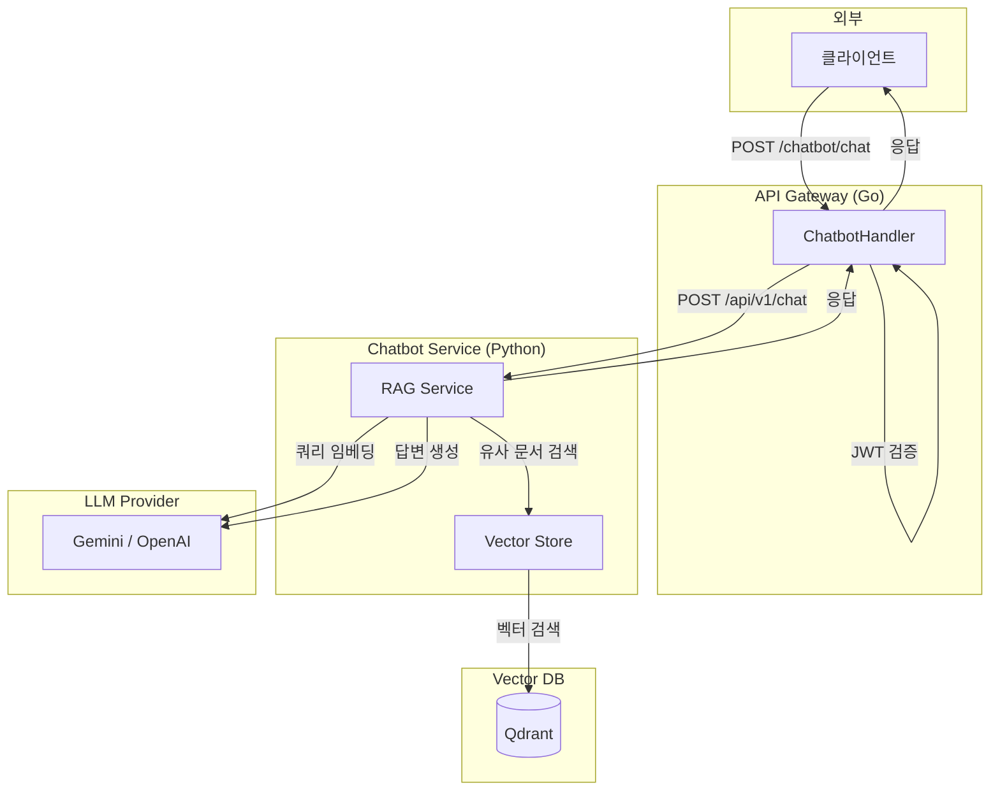
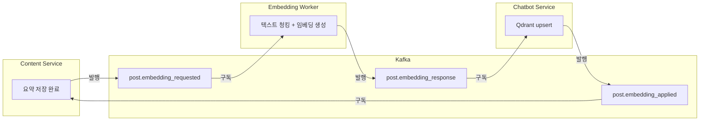

# 챗봇 기능 Phase 1: RAG 기반 MVP

이 문서는 Tech-Letter 챗봇 기능의 **Phase 1 구현 내용**을 정리한다.

---

## 1. 개요

### 1.1 목표

- **API Gateway(Go)**를 단일 진입점으로 유지하면서, RAG 챗봇 기능을 외부 사용자에게 제공
- 내부적으로는 **이벤트 기반 임베딩 파이프라인**(요약 → 임베딩 → Vector DB upsert)을 통해 검색 품질 확보

### 1.2 제공 기능

| 기능              | 설명                                    |
| ----------------- | --------------------------------------- |
| RAG 챗봇 질의 API | `POST /api/v1/chatbot/chat`             |
| 사용 조건         | 로그인된 사용자(JWT 유효)               |
| 크레딧/쿼터       | Phase 1에서는 미적용 (Phase 2에서 도입) |

---

## 2. 아키텍처

### 2.1 전체 흐름



### 2.2 임베딩 파이프라인 (데이터 준비)



| 단계 | 서비스           | 설명                                              |
| ---- | ---------------- | ------------------------------------------------- |
| 1    | Content Service  | 요약 저장 성공 후 `post.embedding_requested` 발행 |
| 2    | Embedding Worker | 텍스트 청킹 + 임베딩 생성 (캐시 적용)             |
| 3    | Embedding Worker | `post.embedding_response` 발행                    |
| 4    | Chatbot Service  | Qdrant에 청크 임베딩 upsert                       |
| 5    | Chatbot Service  | `post.embedding_applied` 발행                     |
| 6    | Content Service  | Post 문서에 `status.embedded=true` 반영           |

---

## 3. API 명세

### 3.1 채팅 API

```
POST /api/v1/chatbot/chat
```

**Request:**

```json
{
  "query": "React에서 성능을 최적화하는 방법은?"
}
```

**Response (성공):**

```json
{
  "answer": "React 성능 최적화를 위해..."
}
```

> [!NOTE]
> Phase 1에서는 외부 공개 정책상 `sources`를 노출하지 않고 `answer`만 반환한다.

### 3.2 에러 응답

| 상태 코드 | 에러 코드             | 설명                     |
| --------- | --------------------- | ------------------------ |
| 400       | `invalid_request`     | 요청 형식 오류           |
| 401       | `unauthorized`        | 로그인 필요/토큰 오류    |
| 429       | `rate_limited`        | AI API rate limit        |
| 503       | `chatbot_unavailable` | 챗봇/AI 제공자 일시 장애 |
| 500       | `chatbot_failed`      | 기타 서버 오류           |

---

## 4. 구현 상세

### 4.1 주요 컴포넌트

| 컴포넌트        | 파일                                          | 설명                             |
| --------------- | --------------------------------------------- | -------------------------------- |
| Gateway Handler | `cmd/api/handlers/chatbot_handlers.go`        | JWT 검증 후 Chatbot Service 호출 |
| Gateway Service | `cmd/api/services/chatbot_service.go`         | HTTP 에러 정규화                 |
| RAG Service     | `chatbot_service/app/services/rag_service.py` | 쿼리 임베딩 → 검색 → LLM 답변    |
| Vector Store    | `chatbot_service/app/vector_store.py`         | Qdrant 연동                      |
| Chat API        | `chatbot_service/app/api/chat.py`             | FastAPI 라우터                   |

### 4.2 RAG 프롬프트 설계

- **보안**: 시스템 프롬프트 노출 방지, 역할 변경 시도 거부
- **두 가지 모드**:
  - **콘텐츠 추천**: 키워드 검색 시 관련 게시글 목록 제공
  - **인사이트 생성**: "How to...", "Why..." 질문 시 종합 답변 생성
- **언어**: 한국어 전용
- **출처**: 참고 문헌 섹션에 제목/링크 표시

### 4.3 환경변수

| 변수                       | 기본값                        | 설명                        |
| -------------------------- | ----------------------------- | --------------------------- |
| `CHATBOT_SERVICE_BASE_URL` | `http://chatbot_service:8003` | Gateway → Chatbot 내부 주소 |
| `QDRANT_URL`               | `http://qdrant:6333`          | Vector DB 주소              |
| `EMBEDDING_MODEL`          | `text-embedding-004`          | 임베딩 모델                 |
| `CHAT_MODEL`               | `gemini-2.0-flash`            | LLM 모델                    |

---

## 5. 배포

### 5.1 Docker Compose 서비스

```yaml
# docker-compose.dev.yml / docker-compose.prod.yml
services:
  chatbot_service:
    build:
      dockerfile: Dockerfile.chatbot_service
    ports:
      - "8003:8003"
    depends_on:
      - qdrant
      - kafka

  embedding_worker:
    build:
      dockerfile: Dockerfile.embedding_worker
    depends_on:
      - kafka
      - mongodb

  qdrant:
    image: qdrant/qdrant:latest
    ports:
      - "6333:6333"
```

---

## 6. Phase 1 체크리스트

- [x] Embedding Worker 구현 (텍스트 청킹 + 임베딩 생성)
- [x] Chatbot Service 구현 (Qdrant 연동 + RAG)
- [x] API Gateway 챗봇 핸들러 구현
- [x] 이벤트 기반 파이프라인 구축 (`post.embedding_*`)
- [x] 429/503 에러 정규화
- [x] Docker Compose 배포 설정
- [x] 프로덕션 배포 및 모니터링

---

## 7. 다음 단계 (Phase 2)

Phase 2에서는 다음 기능을 추가한다:

- **크레딧 시스템**: 일일 10개 충전, 채팅당 1 크레딧 소모
- **대화 세션**: 대화 내역 저장 및 조회
- **이벤트 드리븐 확장**: 크레딧/채팅 이벤트

자세한 내용은 [chatbot_phase2.md](./chatbot_phase2.md) 참조.
