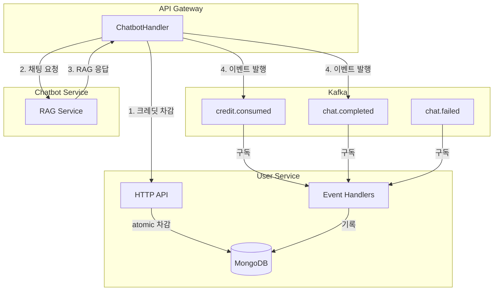
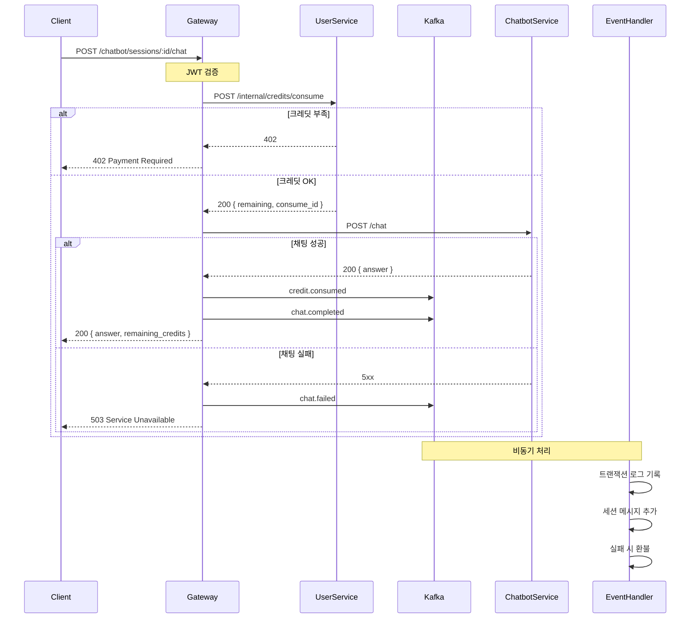

# 챗봇 기능 Phase 2: 크레딧 시스템 & 대화 세션

이 문서는 Tech-Letter 챗봇 기능의 **Phase 2 설계 및 구현 계획**을 정리한다.

---

## 1. 개요

Phase 1에서 구축한 RAG 기반 챗봇에 **사용량 제한(크레딧 시스템)**과 **대화 내역 저장(세션)** 기능을 이벤트 드리븐 아키텍처로 추가한다.

### 1.1 확정된 정책

| 항목               | 결정                          |
| ------------------ | ----------------------------- |
| 크레딧 충전        | 모든 유저 매일 10개 자동 충전 |
| 크레딧 유효기간    | 1일 (다음 날 미사용분 소멸)   |
| 채팅 비용          | 1 채팅 = 1 크레딧             |
| 크레딧 부족 응답   | `402 Payment Required`        |
| 대화 세션          | 영구 저장 (만료 없음)         |
| 세션 제목 생성     | 첫 질문 앞 30자               |
| 세션 저장 서비스   | `user_service`                |
| 트랜잭션 로그 TTL  | 무제한                        |
| 이벤트 발행 실패   | 실패로 응답                   |
| 관리자 크레딧 부여 | Phase 2에 포함                |
| 아키텍처           | 이벤트 드리븐 (Kafka)         |

---

## 2. 아키텍처

### 2.1 전체 흐름



### 2.2 동기/비동기 분리 원칙

| 작업              | 처리 방식 | 이유              |
| ----------------- | --------- | ----------------- |
| 크레딧 확인/차감  | 동기      | 즉시 일관성 필요  |
| 채팅 요청/응답    | 동기      | latency           |
| 이벤트 발행       | 동기      | 실패 시 전체 실패 |
| 트랜잭션 로그     | 비동기    | 부수 효과         |
| 세션 메시지 추가  | 비동기    | 부수 효과         |
| 채팅 실패 시 환불 | 비동기    | 이벤트 핸들러     |

---

## 3. 이벤트 설계

### 3.1 새 Kafka 토픽

| 토픽                 | 설명               |
| -------------------- | ------------------ |
| `tech-letter.credit` | 크레딧 관련 이벤트 |
| `tech-letter.chat`   | 채팅 관련 이벤트   |

### 3.2 이벤트 타입

```python
# credit 이벤트
class CreditEventType:
    CREDIT_CONSUMED = "credit.consumed"
    CREDIT_GRANTED = "credit.granted"

# chat 이벤트
class ChatEventType:
    CHAT_COMPLETED = "chat.completed"
    CHAT_FAILED = "chat.failed"
```

### 3.3 이벤트 페이로드

#### credit.consumed

```json
{
  "id": "evt-123",
  "type": "credit.consumed",
  "timestamp": "2024-12-18T10:30:00Z",
  "source": "api-gateway",
  "version": "1.0",
  "user_code": "google:uuid-xxx",
  "credit_date": "2024-12-18",
  "amount": 1,
  "remaining": 9,
  "reason": "chat",
  "session_id": "session-456"
}
```

#### chat.completed

```json
{
  "id": "evt-456",
  "type": "chat.completed",
  "timestamp": "2024-12-18T10:30:05Z",
  "source": "api-gateway",
  "version": "1.0",
  "user_code": "google:uuid-xxx",
  "session_id": "session-456",
  "query": "React에서 성능을 최적화하는 방법은?",
  "answer": "React 성능 최적화를 위해...",
  "sources": [...],
  "credit_consumed_id": "evt-123"
}
```

#### chat.failed

```json
{
  "id": "evt-789",
  "type": "chat.failed",
  "timestamp": "2024-12-18T10:30:05Z",
  "source": "api-gateway",
  "version": "1.0",
  "user_code": "google:uuid-xxx",
  "session_id": "session-456",
  "query": "React에서...",
  "error_code": "chatbot_unavailable",
  "credit_consumed_id": "evt-123"
}
```

---

## 4. 크레딧 시스템

### 4.1 MongoDB 컬렉션

#### credits

```javascript
{
  _id: ObjectId,
  user_code: "google:uuid-xxx",
  credit_date: "2024-12-18",
  remaining: 7,
  granted: 10,
  created_at: ISODate,
  updated_at: ISODate
}

// 인덱스
{ user_code: 1, credit_date: 1 }  // unique
```

#### credit_transactions

```javascript
{
  _id: ObjectId,
  user_code: "google:uuid-xxx",
  credit_date: "2024-12-18",
  type: "consume",  // grant | consume | refund | admin_grant
  amount: 1,
  reason: "chat",
  metadata: { session_id, event_id },
  created_at: ISODate
}

// 인덱스
{ user_code: 1, created_at: -1 }
{ credit_date: 1, type: 1 }
```

### 4.2 일일 자동 충전 (Lazy Initialization)

```python
def get_or_create_today_credits(user_code: str) -> Credits:
    """오늘 크레딧 조회/생성. 첫 호출 시 10 크레딧 자동 부여."""
    today = date.today().isoformat()

    doc = self._col.find_one_and_update(
        {"user_code": user_code, "credit_date": today},
        {
            "$setOnInsert": {
                "granted": 10,
                "remaining": 10,
                "created_at": datetime.now(timezone.utc),
            },
            "$set": {"updated_at": datetime.now(timezone.utc)}
        },
        upsert=True,
        return_document=ReturnDocument.AFTER,
    )
    return self._from_document(doc)
```

### 4.3 Atomic 크레딧 차감

```python
def consume(self, user_code: str, amount: int = 1) -> Credits | None:
    """크레딧 차감. 잔액 부족 시 None 반환."""
    today = date.today().isoformat()
    self.get_or_create_today_credits(user_code)

    doc = self._col.find_one_and_update(
        {
            "user_code": user_code,
            "credit_date": today,
            "remaining": {"$gte": amount}
        },
        {
            "$inc": {"remaining": -amount},
            "$set": {"updated_at": datetime.now(timezone.utc)}
        },
        return_document=ReturnDocument.AFTER,
    )
    return self._from_document(doc) if doc else None
```

### 4.4 크레딧 API

| Method | Endpoint                                  | 설명             | 인증  |
| ------ | ----------------------------------------- | ---------------- | ----- |
| `GET`  | `/api/v1/users/credits`                   | 오늘 크레딧 조회 | JWT   |
| `GET`  | `/api/v1/users/credits/history`           | 사용 이력 조회   | JWT   |
| `POST` | `/api/v1/admin/users/:code/credits/grant` | 크레딧 부여      | Admin |

---

## 5. 대화 세션

### 5.1 MongoDB 스키마

```javascript
// chat_sessions
{
  _id: ObjectId,
  user_code: "google:uuid-xxx",
  title: "React 성능 최적화 질문...",  // 첫 질문 앞 30자
  messages: [
    { role: "user", content: "React에서...", created_at: ISODate },
    { role: "assistant", content: "답변...", created_at: ISODate }
  ],
  created_at: ISODate,
  updated_at: ISODate
}

// 인덱스
{ user_code: 1, updated_at: -1 }
```

### 5.2 세션 제목 생성

```python
def generate_title(query: str) -> str:
    """첫 질문에서 세션 제목 생성 (앞 30자)."""
    title = query.strip()[:30]
    if len(query) > 30:
        title += "..."
    return title
```

### 5.3 세션 API

| Method   | Endpoint                            | 설명      |
| -------- | ----------------------------------- | --------- |
| `GET`    | `/api/v1/chatbot/sessions`          | 세션 목록 |
| `POST`   | `/api/v1/chatbot/sessions`          | 새 세션   |
| `GET`    | `/api/v1/chatbot/sessions/:id`      | 세션 상세 |
| `DELETE` | `/api/v1/chatbot/sessions/:id`      | 세션 삭제 |
| `POST`   | `/api/v1/chatbot/sessions/:id/chat` | 채팅      |

---

## 6. 채팅 흐름 (최종)



---

## 7. 이벤트 핸들러

### 7.1 크레딧 이벤트 핸들러

```python
class CreditEventHandler:
    def handle_credit_consumed(self, event):
        """트랜잭션 로그 기록."""
        self._transaction_repo.create(
            user_code=event.user_code,
            credit_date=event.credit_date,
            type="consume",
            amount=event.amount,
            reason=event.reason,
            metadata={"session_id": event.session_id},
        )

    def handle_credit_granted(self, event):
        """관리자 부여 로그 기록."""
        self._transaction_repo.create(...)
```

### 7.2 채팅 이벤트 핸들러

```python
class ChatEventHandler:
    def handle_chat_completed(self, event):
        """세션에 메시지 추가."""
        self._session_repo.append_messages(
            session_id=event.session_id,
            messages=[
                ChatMessage(role="user", content=event.query),
                ChatMessage(role="assistant", content=event.answer),
            ]
        )

    def handle_chat_failed(self, event):
        """크레딧 환불."""
        self._credit_service.refund(
            user_code=event.user_code,
            amount=1,
            original_consume_id=event.credit_consumed_id,
        )
```

---

## 8. 구현 계획

### Phase 2-A: 크레딧 시스템 (~3일)

| #   | 작업                   | 파일                                           |
| --- | ---------------------- | ---------------------------------------------- |
| 1   | 새 토픽 추가           | `topics.py`, `topics.go`                       |
| 2   | 이벤트 정의            | `events/credit.py`, `events/chat.py`           |
| 3   | 크레딧 모델/레포지토리 | `models/credit.py`, `repositories/credit_*.py` |
| 4   | 크레딧 서비스          | `services/credit_service.py`                   |
| 5   | 크레딧 API             | `api/credits.py`                               |
| 6   | 이벤트 핸들러          | `event_handlers/credit_handler.py`             |
| 7   | Gateway 연동           | `handlers/chatbot_handlers.go`                 |
| 8   | 관리자 API             | `handlers/admin_handlers.go`                   |

### Phase 2-B: 대화 세션 (~3일)

| #   | 작업                 | 파일                                                       |
| --- | -------------------- | ---------------------------------------------------------- |
| 1   | 세션 모델/레포지토리 | `models/chat_session.py`, `repositories/chat_session_*.py` |
| 2   | 세션 서비스          | `services/chat_session_service.py`                         |
| 3   | 세션 API             | `api/chat_sessions.py`                                     |
| 4   | 이벤트 핸들러        | `event_handlers/chat_handler.py`                           |
| 5   | Gateway 핸들러       | `handlers/session_handlers.go`                             |
| 6   | 라우터 등록          | `router/router.go`                                         |

---

## 9. 파일 변경 목록

### 신규 파일 (16개)

| 경로                                                               | 설명          |
| ------------------------------------------------------------------ | ------------- |
| `common/common/events/credit.py`                                   | 크레딧 이벤트 |
| `common/common/events/chat.py`                                     | 채팅 이벤트   |
| `user_service/app/models/credit.py`                                | 크레딧 모델   |
| `user_service/app/models/chat_session.py`                          | 세션 모델     |
| `user_service/app/repositories/documents/credit_document.py`       | -             |
| `user_service/app/repositories/documents/chat_session_document.py` | -             |
| `user_service/app/repositories/credit_repository.py`               | -             |
| `user_service/app/repositories/chat_session_repository.py`         | -             |
| `user_service/app/services/credit_service.py`                      | -             |
| `user_service/app/services/chat_session_service.py`                | -             |
| `user_service/app/api/credits.py`                                  | -             |
| `user_service/app/api/chat_sessions.py`                            | -             |
| `user_service/app/event_handlers/credit_handler.py`                | -             |
| `user_service/app/event_handlers/chat_handler.py`                  | -             |
| `cmd/api/dto/credit.go`                                            | -             |
| `cmd/api/dto/session.go`                                           | -             |
| `cmd/api/handlers/session_handlers.go`                             | -             |

### 수정 파일 (8개)

| 경로                                          | 변경          |
| --------------------------------------------- | ------------- |
| `common/common/eventbus/topics.py`            | 새 토픽       |
| `cmd/internal/eventbus/topics.go`             | 새 토픽       |
| `user_service/app/main.py`                    | 이벤트 컨슈머 |
| `user_service/app/repositories/interfaces.py` | 인터페이스    |
| `cmd/api/handlers/chatbot_handlers.go`        | 크레딧/세션   |
| `cmd/api/handlers/admin_handlers.go`          | 관리자 크레딧 |
| `cmd/api/clients/userclient/client.go`        | 클라이언트    |
| `cmd/api/router/router.go`                    | 라우트        |

---

## 10. 검증 계획

### 기능 테스트

1. **일일 리셋**: 어제 7개 → 오늘 첫 조회 → 10개
2. **차감/환불**: 성공 → 1 차감, 실패 → 환불
3. **크레딧 부족**: 10회 후 → `402`
4. **세션**: 생성 → 채팅 → 메시지 추가
5. **관리자**: 크레딧 부여 → 로그 확인

### 이벤트 테스트

1. 이벤트 발행 → Kafka 확인
2. 핸들러 → DB 기록 확인
3. 핸들러 실패 → 재시도 토픽
