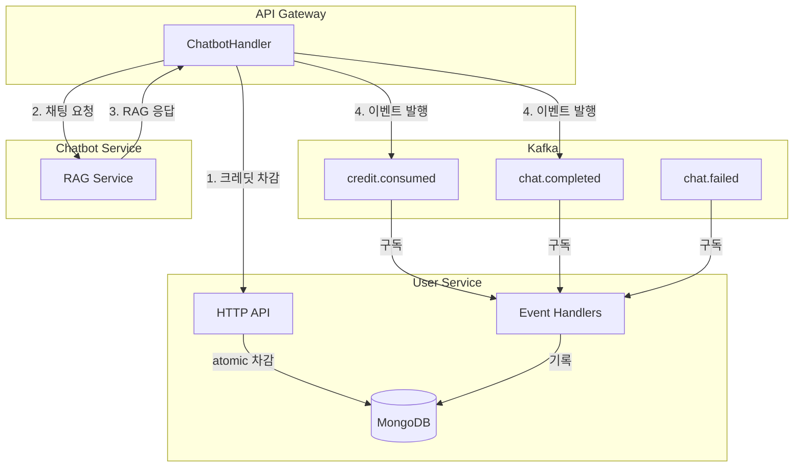
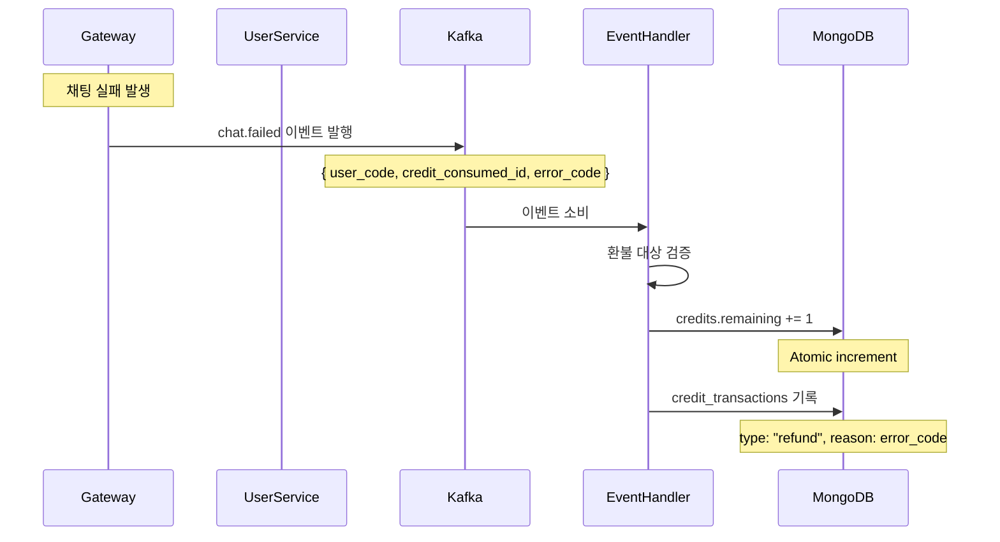
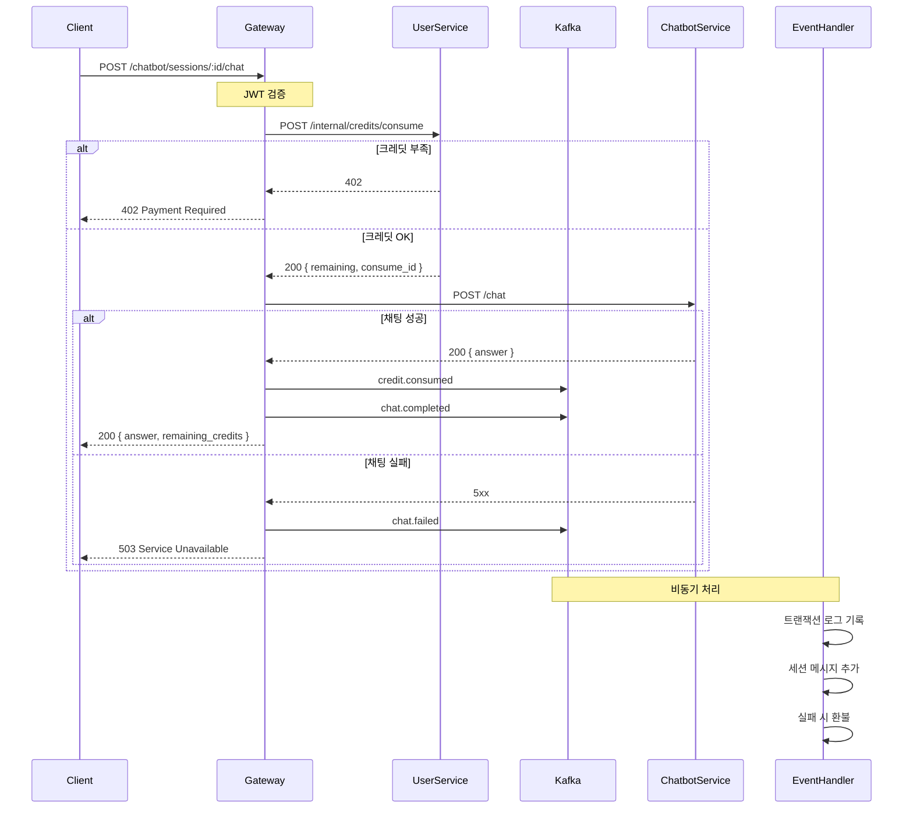

# 챗봇 기능 Phase 2: 크레딧 시스템 & 대화 세션

이 문서는 Tech-Letter 챗봇 기능의 **Phase 2 설계 및 구현 계획**을 정리한다.

- **Phase 2-A**: 크레딧 시스템 (사용량 제한)
- **Phase 2-B**: 대화 세션 (대화 내역 저장)

---

## 1. 개요

Phase 1에서 구축한 RAG 기반 챗봇에 **사용량 제한(크레딧 시스템)**과 **대화 내역 저장(세션)** 기능을 이벤트 드리븐 아키텍처로 추가한다.

### 1.1 확정된 정책

| 항목               | 결정                          |
| ------------------ | ----------------------------- |
| 크레딧 충전        | 모든 유저 매일 10개 자동 충전 |
| 크레딧 유효기간    | 1일 (다음 날 미사용분 소멸)   |
| 채팅 비용          | 1 채팅 = 1 크레딧             |
| 크레딧 부족 응답   | `402 Payment Required`        |
| 대화 세션          | 영구 저장 (만료 없음)         |
| 세션 제목 생성     | 첫 질문 앞 30자               |
| 세션 저장 서비스   | `user_service`                |
| 트랜잭션 로그 TTL  | 무제한                        |
| 이벤트 발행 실패   | 실패로 응답                   |
| 관리자 크레딧 부여 | Phase 2에 포함                |
| 아키텍처           | 이벤트 드리븐 (Kafka)         |

---

## 2. 아키텍처

### 2.1 전체 흐름



### 2.2 동기/비동기 분리 원칙

| 작업              | 처리 방식 | 이유              |
| ----------------- | --------- | ----------------- |
| 크레딧 확인/차감  | 동기      | 즉시 일관성 필요  |
| 채팅 요청/응답    | 동기      | latency           |
| 이벤트 발행       | 동기      | 실패 시 전체 실패 |
| 트랜잭션 로그     | 비동기    | 부수 효과         |
| 세션 메시지 추가  | 비동기    | 부수 효과         |
| 채팅 실패 시 환불 | 비동기    | 이벤트 핸들러     |

---

## 3. Common 패키지 활용 (기존 관행)

Phase 2 구현 시 기존 `common` 패키지의 패턴을 따른다.

### 3.1 MongoDB Document 패턴

```python
# 기존 관행: common/mongo/types.py의 BaseDocument 상속
from common.mongo.types import BaseDocument, MongoDateTime, PyObjectId

class CreditDocument(BaseDocument):
    """credits 컬렉션 도큐먼트."""
    user_code: str
    remaining: int
    granted: int
    expired_at: MongoDateTime  # UTC datetime 자동 정규화

    @classmethod
    def from_domain(cls, credit: Credit) -> "CreditDocument":
        data = build_document_data_from_domain(credit)
        return cls.model_validate(data)

    def to_domain(self) -> Credit:
        return Credit(
            id=from_object_id(self.id),
            user_code=self.user_code,
            # ...
        )
```

**활용할 타입:**

- `BaseDocument`: MongoDB 공통 필드 (`_id`, `created_at`, `updated_at`)
- `MongoDateTime`: UTC 기준 datetime 자동 정규화
- `PyObjectId`: ObjectId 타입 변환
- `build_document_data_from_domain()`: 도메인 → Document 변환

### 3.2 이벤트 정의 패턴

```python
# 기존 관행: @dataclass(slots=True) + from_dict 클래스메서드
from dataclasses import dataclass
from typing import Any, Mapping, Self

@dataclass(slots=True)
class CreditConsumedEvent:
    id: str
    type: str
    timestamp: str
    source: str
    version: str
    user_code: str
    credit_expired_at: str  # ISO8601 문자열
    amount: int
    remaining: int
    reason: str
    session_id: str

    @classmethod
    def from_dict(cls, data: Mapping[str, Any]) -> Self:
        return cls(
            id=str(data["id"]),
            type=str(data["type"]),
            timestamp=str(data["timestamp"]),
            source=str(data["source"]),
            version=str(data.get("version", "1.0")),
            user_code=str(data["user_code"]),
            credit_expired_at=str(data["credit_expired_at"]),
            amount=int(data["amount"]),
            remaining=int(data["remaining"]),
            reason=str(data["reason"]),
            session_id=str(data["session_id"]),
        )
```

### 3.3 이벤트 발행 패턴

```python
# 기존 관행: new_json_event + asdict + KafkaEventBus.publish
from dataclasses import asdict
from common.eventbus.helpers import new_json_event
from common.eventbus.kafka import get_kafka_event_bus

event_id = str(uuid.uuid4())
timestamp = datetime.now(timezone.utc).isoformat()

event = CreditConsumedEvent(
    id=event_id,
    type=CreditEventType.CREDIT_CONSUMED,
    timestamp=timestamp,
    source="user-service",
    version="1.0",
    # ...
)

wrapped = new_json_event(payload=asdict(event), event_id=event_id)
bus = get_kafka_event_bus()
bus.publish(TOPIC_CREDIT.base, wrapped)
```

### 3.4 Repository 패턴

```python
# 기존 관행: Interface + 구체 구현 분리
# user_service/app/repositories/interfaces.py
class CreditRepositoryInterface(Protocol):
    def get_active(self, user_code: str) -> Credit | None: ...
    def consume(self, user_code: str, amount: int) -> tuple[Credit, str] | None: ...
    def refund(self, user_code: str, expired_at: datetime, amount: int) -> Credit: ...

# user_service/app/repositories/credit_repository.py
class CreditRepository(CreditRepositoryInterface):
    def __init__(self, database: Database) -> None:
        self._db = database
        self._col = database["credits"]
    # ...
```

---

## 4. 이벤트 설계

### 4.1 새 Kafka 토픽

| 토픽                 | 설명               |
| -------------------- | ------------------ |
| `tech-letter.credit` | 크레딧 관련 이벤트 |
| `tech-letter.chat`   | 채팅 관련 이벤트   |

### 3.2 이벤트 타입

```python
# credit 이벤트
class CreditEventType:
    CREDIT_CONSUMED = "credit.consumed"
    CREDIT_GRANTED = "credit.granted"

# chat 이벤트
class ChatEventType:
    CHAT_COMPLETED = "chat.completed"
    CHAT_FAILED = "chat.failed"
```

### 3.3 이벤트 페이로드

#### credit.consumed

```json
{
  "id": "a1b2c3d4-e5f6-4a7b-8c9d-0e1f2a3b4c5d",
  "type": "credit.consumed",
  "timestamp": "2024-12-18T10:30:00Z",
  "source": "api-gateway",
  "version": "1.0",
  "user_code": "google:uuid-xxx",
  "credit_expired_at": "2024-12-19T00:00:00Z",
  "amount": 1,
  "remaining": 9,
  "reason": "chat",
  "session_id": "67890abc-def0-4123-4567-89abcdef0123"
}
```

#### chat.completed

```json
{
  "id": "b2c3d4e5-f6a7-4b8c-9d0e-1f2a3b4c5d6e",
  "type": "chat.completed",
  "timestamp": "2024-12-18T10:30:05Z",
  "source": "api-gateway",
  "version": "1.0",
  "user_code": "google:uuid-xxx",
  "session_id": "67890abc-def0-4123-4567-89abcdef0123",
  "query": "React에서 성능을 최적화하는 방법은?",
  "answer": "React 성능 최적화를 위해...",
  "sources": [...],
  "credit_consumed_id": "a1b2c3d4-e5f6-4a7b-8c9d-0e1f2a3b4c5d"
}
```

#### chat.failed

```json
{
  "id": "c3d4e5f6-a7b8-4c9d-0e1f-2a3b4c5d6e7f",
  "type": "chat.failed",
  "timestamp": "2024-12-18T10:30:05Z",
  "source": "api-gateway",
  "version": "1.0",
  "user_code": "google:uuid-xxx",
  "session_id": "67890abc-def0-4123-4567-89abcdef0123",
  "query": "React에서...",
  "error_code": "chatbot_unavailable",
  "credit_consumed_id": "a1b2c3d4-e5f6-4a7b-8c9d-0e1f2a3b4c5d"
}
```

---

# Phase 2-A: 크레딧 시스템

기존 `/chatbot/chat` API에 크레딧 차감 기능을 추가한다.

## A.1 크레딧 정책

| 항목        | 결정                   |
| ----------- | ---------------------- |
| 충전        | 매일 10개 자동         |
| 유효기간    | 1일 (다음 날 소멸)     |
| 채팅 비용   | 1회 = 1 크레딧         |
| 부족 응답   | `402 Payment Required` |
| 관리자 부여 | 포함                   |

## A.2 MongoDB 컬렉션

### credits

```javascript
{
  _id: ObjectId,
  user_code: "google:uuid-xxx",
  remaining: 7,
  granted: 10,
  expired_at: ISODate("2024-12-19T00:00:00Z"),  // 만료 일시
  created_at: ISODate,
  updated_at: ISODate
}

// 인덱스
{ user_code: 1, expired_at: 1 }  // unique
{ expired_at: 1 }                 // TTL 인덱스 (선택적)
```

> [!NOTE] > **설계 의도**: `expired_at`을 사용하면 비즈니스 로직(일일/주간/월간 충전)과 데이터 구조가 분리됨
>
> - 일일 충전: `expired_at = 다음 날 00:00:00`
> - 월간 충전: `expired_at = 다음 달 1일 00:00:00`
> - TTL 인덱스로 만료된 데이터 자동 삭제 가능

#### credit_transactions

```javascript
{
  _id: ObjectId,
  user_code: "google:uuid-xxx",
  credit_expired_at: ISODate("2024-12-19T00:00:00Z"),  // 연결된 크레딧의 만료일시
  type: "consume",  // grant | consume | refund | admin_grant
  amount: 1,
  reason: "chat",
  metadata: { session_id, event_id },
  created_at: ISODate
}

// 인덱스
{ user_code: 1, created_at: -1 }
{ credit_expired_at: 1, type: 1 }
```

## A.3 일일 자동 충전 (Lazy Initialization)

```python
def get_or_create_active_credits(user_code: str) -> Credits:
    """현재 유효한 크레딧 조회/생성. 없으면 10 크레딧 자동 부여."""
    now = datetime.now(timezone.utc)

    # 현재 시간 기준 유효한 크레딧 조회
    doc = self._col.find_one({
        "user_code": user_code,
        "expired_at": {"$gt": now}
    })

    if doc:
        return self._from_document(doc)

    # 유효한 크레딧 없음 -> 새로 생성 (다음 날 00:00:00 만료)
    tomorrow_midnight = (now + timedelta(days=1)).replace(
        hour=0, minute=0, second=0, microsecond=0
    )

    new_doc = {
        "user_code": user_code,
        "granted": 10,
        "remaining": 10,
        "expired_at": tomorrow_midnight,
        "created_at": now,
        "updated_at": now,
    }
    self._col.insert_one(new_doc)
    return self._from_document(new_doc)
```

## A.4 Atomic 크레딧 차감

```python
def consume(self, user_code: str, amount: int = 1) -> tuple[Credits, str] | None:
    """크레딧 차감. 잔액 부족 시 None 반환. 성공 시 (Credits, expired_at_iso) 반환."""
    now = datetime.now(timezone.utc)
    credits = self.get_or_create_active_credits(user_code)

    doc = self._col.find_one_and_update(
        {
            "user_code": user_code,
            "expired_at": {"$gt": now},
            "remaining": {"$gte": amount}
        },
        {
            "$inc": {"remaining": -amount},
            "$set": {"updated_at": now}
        },
        return_document=ReturnDocument.AFTER,
    )
    if not doc:
        return None

    result = self._from_document(doc)
    return result, result.expired_at.isoformat()
```

## A.5 채팅 실패 시 크레딧 환불

> [!IMPORTANT] > **크레딧 차감 기준**: AI 호출 성공 여부
>
> - AI 호출 성공 → 크레딧 유지 (답변 품질과 무관)
> - AI 호출 실패 → 환불

#### 처리 흐름

1. **Gateway: 요청 검증** → 실패 시 `400 invalid_request` (크레딧 차감 안 함)
2. **Gateway: 크레딧 차감**
3. **Chatbot Service: AI 호출**
4. **성공 → 크레딧 유지 / 실패 → 환불**

#### 환불 케이스

| 실패 유형           | 에러 코드             | 환불 여부 |
| ------------------- | --------------------- | --------- |
| AI API Rate Limit   | `rate_limited`        | ✅ 환불   |
| AI API 서버 장애    | `chatbot_unavailable` | ✅ 환불   |
| Chatbot Service 5xx | `chatbot_unavailable` | ✅ 환불   |
| 이벤트 발행 실패    | `internal_error`      | ✅ 환불   |

#### 크레딧 차감 전 검증 (환불 불필요)

| 검증 단계      | 에러 코드              | 처리             |
| -------------- | ---------------------- | ---------------- |
| 요청 형식 오류 | `invalid_request`      | 차감 전 → 400    |
| 크레딧 부족    | `insufficient_credits` | 차감 안 함 → 402 |

#### 환불 흐름



#### 환불 로직

```python
def refund(self, user_code: str, expired_at: datetime, amount: int = 1) -> Credits:
    """채팅 실패로 인한 크레딧 환불."""
    doc = self._col.find_one_and_update(
        {"user_code": user_code, "expired_at": expired_at},
        {
            "$inc": {"remaining": amount},
            "$set": {"updated_at": datetime.now(timezone.utc)}
        },
        return_document=ReturnDocument.AFTER,
    )
    if not doc:
        raise ValueError(f"Credits not found: {user_code}, expired_at={expired_at}")
    return self._from_document(doc)
```

#### 환불 트랜잭션 로그

```javascript
// credit_transactions (환불 기록)
{
  _id: ObjectId,
  user_code: "google:uuid-xxx",
  credit_expired_at: ISODate("2024-12-19T00:00:00Z"),
  type: "refund",
  amount: 1,
  reason: "chatbot_unavailable",
  metadata: {
    original_consume_id: "a1b2c3d4-e5f6-4a7b-8c9d-0e1f2a3b4c5d",
    chat_failed_id: "c3d4e5f6-a7b8-4c9d-0e1f-2a3b4c5d6e7f",
    error_code: "chatbot_unavailable"
  },
  created_at: ISODate
}
```

## A.6 크레딧 API

| Method | Endpoint                                  | 설명                                       | 인증  |
| ------ | ----------------------------------------- | ------------------------------------------ | ----- |
| `GET`  | `/api/v1/users/credits`                   | 현재 사용자의 오늘 사용 가능한 크레딧 조회 | JWT   |
| `GET`  | `/api/v1/users/credits/history`           | 현재 사용자의 크레딧 사용 이력 조회        | JWT   |
| `POST` | `/api/v1/admin/users/:code/credits/grant` | 특정 사용자에게 크레딧 부여                | Admin |

**크레딧 조회 응답 예시:**

```json
{
  "remaining": 7,
  "granted": 10,
  "expired_at": "2024-12-19T00:00:00+09:00"
}
```

- `remaining`: 현재 사용 가능한 크레딧 수
- `granted`: 부여된 총 크레딧 수
- `expired_at`: 크레딧 만료 일시

---

# Phase 2-B: 대화 세션

사용자의 대화 내역을 세션별로 저장하고 조회할 수 있는 기능을 추가한다.

## B.1 세션 정책

| 항목      | 결정             |
| --------- | ---------------- |
| 저장 위치 | `user_service`   |
| 만료      | 없음 (영구 저장) |
| 제목 생성 | 첫 질문 앞 30자  |

## B.2 MongoDB 스키마

```javascript
// chat_sessions
{
  _id: ObjectId,
  user_code: "google:uuid-xxx",
  title: "React 성능 최적화 질문...",  // 첫 질문 앞 30자
  messages: [
    { role: "user", content: "React에서...", created_at: ISODate },
    { role: "assistant", content: "답변...", created_at: ISODate }
  ],
  created_at: ISODate,
  updated_at: ISODate
}

// 인덱스
{ user_code: 1, updated_at: -1 }
```

## B.3 세션 제목 생성

```python
def generate_title(query: str) -> str:
    """첫 질문에서 세션 제목 생성 (앞 30자)."""
    title = query.strip()[:30]
    if len(query) > 30:
        title += "..."
    return title
```

## B.4 세션 API

| Method   | Endpoint                            | 설명      |
| -------- | ----------------------------------- | --------- |
| `GET`    | `/api/v1/chatbot/sessions`          | 세션 목록 |
| `POST`   | `/api/v1/chatbot/sessions`          | 새 세션   |
| `GET`    | `/api/v1/chatbot/sessions/:id`      | 세션 상세 |
| `DELETE` | `/api/v1/chatbot/sessions/:id`      | 세션 삭제 |
| `POST`   | `/api/v1/chatbot/sessions/:id/chat` | 채팅      |

---

## 7. 채팅 흐름 (최종)



---

## 8. 이벤트 핸들러

### 8.1 크레딧 이벤트 핸들러

```python
class CreditEventHandler:
    def handle_credit_consumed(self, event):
        """트랜잭션 로그 기록."""
        self._transaction_repo.create(
            user_code=event.user_code,
            credit_date=event.credit_date,
            type="consume",
            amount=event.amount,
            reason=event.reason,
            metadata={"session_id": event.session_id},
        )

    def handle_credit_granted(self, event):
        """관리자 부여 로그 기록."""
        self._transaction_repo.create(...)
```

### 8.2 채팅 이벤트 핸들러

```python
class ChatEventHandler:
    def handle_chat_completed(self, event):
        """세션에 메시지 추가."""
        self._session_repo.append_messages(
            session_id=event.session_id,
            messages=[
                ChatMessage(role="user", content=event.query),
                ChatMessage(role="assistant", content=event.answer),
            ]
        )

    def handle_chat_failed(self, event):
        """크레딧 환불."""
        self._credit_service.refund(
            user_code=event.user_code,
            amount=1,
            original_consume_id=event.credit_consumed_id,
        )
```

---

## 9. 구현 계획

### Phase 2-A: 크레딧 시스템 (~3일)

| #   | 작업                   | 파일                                           |
| --- | ---------------------- | ---------------------------------------------- |
| 1   | 새 토픽 추가           | `topics.py`, `topics.go`                       |
| 2   | 이벤트 정의            | `events/credit.py`, `events/chat.py`           |
| 3   | 크레딧 모델/레포지토리 | `models/credit.py`, `repositories/credit_*.py` |
| 4   | 크레딧 서비스          | `services/credit_service.py`                   |
| 5   | 크레딧 API             | `api/credits.py`                               |
| 6   | 이벤트 핸들러          | `event_handlers/credit_handler.py`             |
| 7   | Gateway 연동           | `handlers/chatbot_handlers.go`                 |
| 8   | 관리자 API             | `handlers/admin_handlers.go`                   |

### Phase 2-B: 대화 세션 (~3일)

| #   | 작업                 | 파일                                                       |
| --- | -------------------- | ---------------------------------------------------------- |
| 1   | 세션 모델/레포지토리 | `models/chat_session.py`, `repositories/chat_session_*.py` |
| 2   | 세션 서비스          | `services/chat_session_service.py`                         |
| 3   | 세션 API             | `api/chat_sessions.py`                                     |
| 4   | 이벤트 핸들러        | `event_handlers/chat_handler.py`                           |
| 5   | Gateway 핸들러       | `handlers/session_handlers.go`                             |
| 6   | 라우터 등록          | `router/router.go`                                         |

---

## 10. 파일 변경 목록

### 신규 파일 (16개)

| 경로                                                               | 설명          |
| ------------------------------------------------------------------ | ------------- |
| `common/common/events/credit.py`                                   | 크레딧 이벤트 |
| `common/common/events/chat.py`                                     | 채팅 이벤트   |
| `user_service/app/models/credit.py`                                | 크레딧 모델   |
| `user_service/app/models/chat_session.py`                          | 세션 모델     |
| `user_service/app/repositories/documents/credit_document.py`       | -             |
| `user_service/app/repositories/documents/chat_session_document.py` | -             |
| `user_service/app/repositories/credit_repository.py`               | -             |
| `user_service/app/repositories/chat_session_repository.py`         | -             |
| `user_service/app/services/credit_service.py`                      | -             |
| `user_service/app/services/chat_session_service.py`                | -             |
| `user_service/app/api/credits.py`                                  | -             |
| `user_service/app/api/chat_sessions.py`                            | -             |
| `user_service/app/event_handlers/credit_handler.py`                | -             |
| `user_service/app/event_handlers/chat_handler.py`                  | -             |
| `cmd/api/dto/credit.go`                                            | -             |
| `cmd/api/dto/session.go`                                           | -             |
| `cmd/api/handlers/session_handlers.go`                             | -             |

### 수정 파일 (8개)

| 경로                                          | 변경          |
| --------------------------------------------- | ------------- |
| `common/common/eventbus/topics.py`            | 새 토픽       |
| `cmd/internal/eventbus/topics.go`             | 새 토픽       |
| `user_service/app/main.py`                    | 이벤트 컨슈머 |
| `user_service/app/repositories/interfaces.py` | 인터페이스    |
| `cmd/api/handlers/chatbot_handlers.go`        | 크레딧/세션   |
| `cmd/api/handlers/admin_handlers.go`          | 관리자 크레딧 |
| `cmd/api/clients/userclient/client.go`        | 클라이언트    |
| `cmd/api/router/router.go`                    | 라우트        |

---

## 11. 검증 계획

### 기능 테스트

1. **일일 리셋**: 어제 7개 → 오늘 첫 조회 → 10개
2. **차감/환불**: 성공 → 1 차감, 실패 → 환불
3. **크레딧 부족**: 10회 후 → `402`
4. **세션**: 생성 → 채팅 → 메시지 추가
5. **관리자**: 크레딧 부여 → 로그 확인

### 이벤트 테스트

1. 이벤트 발행 → Kafka 확인
2. 핸들러 → DB 기록 확인
3. 핸들러 실패 → 재시도 토픽
